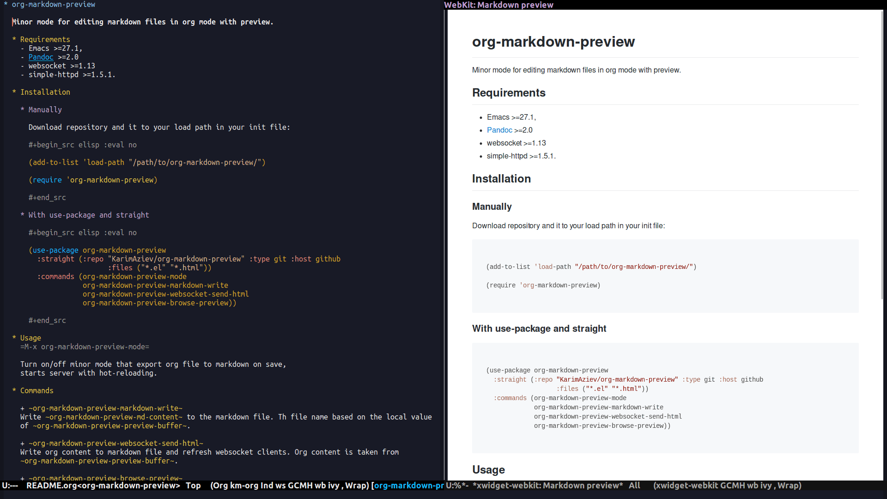

# org-markdown-preview

A minor mode for editing markdown files in org mode with preview.



## Requirements

  - Emacs \>=27.1,
  - [Pandoc](https://pandoc.org/) \>=2.0
  - websocket \>=1.13
  - simple-httpd \>=1.5.1.

## Installation

### Manually

Download repository and it to your load path in your init file:

``` elisp

(add-to-list 'load-path "/path/to/org-markdown-preview/")

(require 'org-markdown-preview)

```

### With use-package and straight

``` elisp

(use-package org-markdown-preview
  :straight (:repo "KarimAziev/org-markdown-preview" :type git :host github
                   :files ("*.el" "*.html"))
  :commands (org-markdown-preview-mode
             org-markdown-preview-markdown-write
             org-markdown-preview-websocket-send-html
             org-markdown-preview-browse-preview))

```

## Usage

`M-x org-markdown-preview-mode`

Turn on/off minor mode that export org file to markdown on save, starts
server with hot-reloading.

## Commands

  - `org-markdown-preview-markdown-write`

Write `org-markdown-preview-md-content` to the markdown file. Th file
name based on the local value of `org-markdown-preview-preview-buffer`.

  - `org-markdown-preview-websocket-send-html`

Write org content to markdown file and refresh websocket clients. Org
content is taken from `org-markdown-preview-preview-buffer`.

  - `org-markdown-preview-browse-preview`

Visit a served page in a browser. Uses `browse-url` to launch a browser

## Customization

  - `org-markdown-preview-pandoc-output-type`

Markdown output type for `pandoc`.
