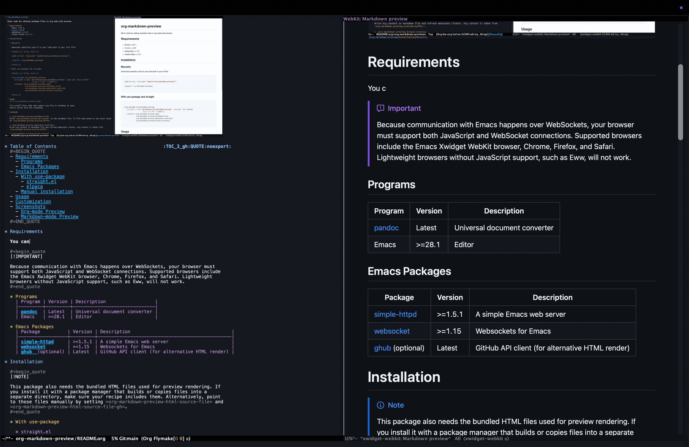
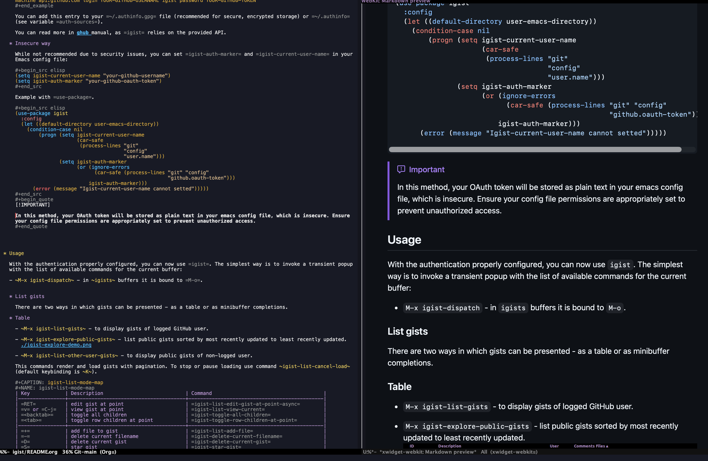
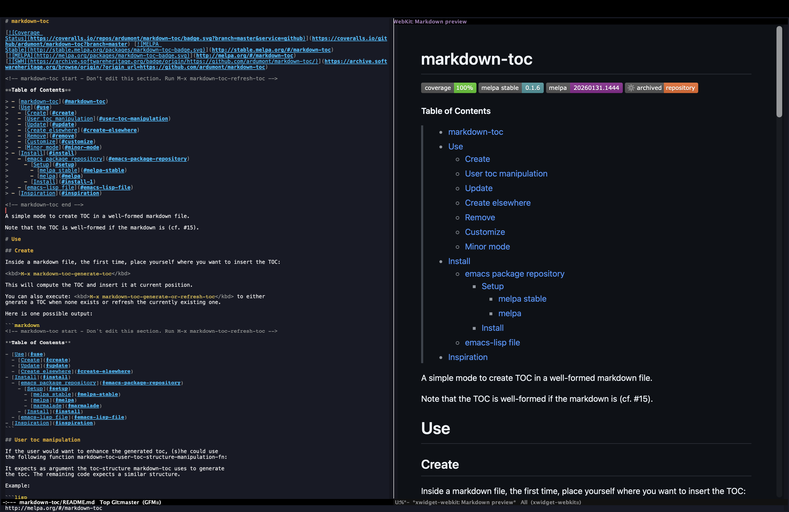

This package provides a minor mode for real-time preview of Org mode and
Markdown files. Both =markdown-mode= and =markdown-ts-mode= are supported.

It also provides commands for converting and copying text.

It supports two rendering workflows: local Pandoc conversion and an alternative GitHub API conversion
(via =ghub=) for GitHub-Flavored Markdown.

* Table of Contents                                       :TOC_3_gh:QUOTE:noexport:
#+BEGIN_QUOTE
- [[#requirements][Requirements]]
  - [[#programs][Programs]]
  - [[#emacs-packages][Emacs Packages]]
- [[#installation][Installation]]
  - [[#with-use-package][With use-package]]
    - [[#straightel][straight.el]]
    - [[#elpaca][elpaca]]
  - [[#manual-installation][Manual installation]]
- [[#usage][Usage]]
- [[#github-api-authentication][GitHub API authentication]]
    - [[#obtaining-a-github-token][Obtaining a GitHub token]]
    - [[#secure-way-using-auth-sources][Secure Way: Using auth-sources]]
    - [[#insecure-way][Insecure way]]
- [[#customization][Customization]]
- [[#screenshots][Screenshots]]
  - [[#org-mode-preview][Org-mode Preview]]
  - [[#markdown-mode-preview][Markdown-mode Preview]]
#+END_QUOTE

* Requirements

#+begin_quote
[!IMPORTANT]

Since the communication with Emacs is done through WebSockets, your browser must
support JavaScript and WebSocket connections (for example, embedded Emacs
Xwidget WebKit browser, Chrome, Firefox or Safari). Note that lightweight
browsers without JavaScript support, such as Eww, will not work.
#+end_quote

** Programs
| Program | Version | Description                  |
|---------+---------+------------------------------|
| [[https://pandoc.org/installing.html][pandoc]]  | Latest  | Universal document converter |
| Emacs   | >=28.1  | Editor                       |

** Emacs Packages
| Package          | Version | Description                                     |
|------------------+---------+-------------------------------------------------|
| [[https://github.com/skeeto/emacs-http-server][simple-httpd]]     | >=1.5.1 | A simple Emacs web server                       |
| [[https://github.com/ahyatt/emacs-websocket][websocket]]        | >=1.15  | Websockets for Emacs                            |
| [[https://github.com/magit/ghub][ghub]]  (optional) | Latest  | GitHub API client (for alternative HTML render) |

* Installation

#+begin_quote
[!NOTE]

The package includes the bundled HTML files used for preview rendering. If
you install it with a package manager that builds or copies files into a
separate directory, make sure your recipe includes them too.

In other words, =markdown-preview.html= and =markdown-preview-gh.html= need to be in the same
directory as =org-markdown-preview.elc=.
#+end_quote

** With use-package

*** straight.el

With =straight.el=, you can install the package like this:

#+begin_src elisp :eval no
(use-package org-markdown-preview
  :straight (:repo "KarimAziev/org-markdown-preview"
             :type git
             :host github
             :files ("*.el" "*.html"))
  :commands (org-markdown-preview-mode))
#+end_src

*** elpaca

#+begin_src elisp :eval no
(use-package org-markdown-preview
  :ensure (:repo "https://github.com/KarimAziev/org-markdown-preview"
                 :files ("*.el" "*.html"))
  :commands (org-markdown-preview-mode))
#+end_src

** Manual installation

Clone the repository wherever you like, for example into
=~/.emacs.d/org-markdown-preview/=:

#+begin_src shell :eval no
git clone https://github.com/KarimAziev/org-markdown-preview.git ~/.emacs.d/org-markdown-preview/
#+end_src

Then add that directory to your load path and require the package:

#+begin_src elisp :eval no
(add-to-list 'load-path "~/.emacs.d/org-markdown-preview/")
(require 'org-markdown-preview)
#+end_src

This setup works as-is because Emacs loads the package directly from the source directory, where the required HTML files are already present.

* Usage

To start the live preview, enable the minor mode in an =org-mode=,
=markdown-mode=, or =markdown-ts-mode= buffer:

~M-x org-markdown-preview-mode RET~

In =org-mode=, the mode converts the current buffer to Markdown and refreshes
the browser preview automatically. In =markdown-mode= and =markdown-ts-mode=
buffers (including their derived modes), it previews the current buffer content
directly.

The package also provides helper commands for copying converted content:
- ~org-markdown-preview-browse-preview~: Opens the preview page again if you
  closed the browser tab or window.
- ~org-markdown-preview-markdown-write~: Writes the current previewed Org
  buffer to a sibling Markdown file.
- ~org-markdown-preview-copy-markdown-as-org~: Copies the selected Markdown region as =org-mode= content.
- ~org-markdown-preview-copy-org-as-markdown~: Copies the selected =org-mode= region as Markdown content.
- ~org-markdown-preview-copy-html-as-org~: Copies the selected HTML region as =org-mode= content.
- ~org-markdown-preview-copy-html-as-markdown~: Copies the selected HTML region as Markdown content.

* GitHub API authentication

When =org-markdown-preview-use-github-api= is non-nil (the default), the
preview uses GitHub's Markdown API through =ghub=. GitHub allows unauthenticated
requests, but they are rate-limited. If you see:

#+begin_example
org-markdown-preview error: http 403
#+end_example

you likely want to configure =org-markdown-preview-gh-auth= or disable GitHub
API rendering by setting =org-markdown-preview-use-github-api= to nil.

The value of =org-markdown-preview-gh-auth= can be:
- nil, to use the GitHub API without authentication.
- A cons cell =(USERNAME . AUTH)=, where =AUTH= is either a GitHub OAuth token
  string or a symbol suffix for an entry in =auth-sources=.
- A function called with no arguments that returns the same =(USERNAME . AUTH)=
  cons cell.

*** Obtaining a GitHub token

Firstly, create a [[https://github.com/settings/tokens][GitHub personal access token]] for the GitHub Markdown API.
GitHub recommends fine-grained personal access tokens where possible.

1. Log in to GitHub and open [[https://github.com/settings/tokens][Developer settings -> Personal access tokens]].
2. Create a fine-grained token, or a classic token if that is what your setup
   requires.
3. Give the token a descriptive name, such as =org-markdown-preview=, and choose
   an expiration.
4. For normal public Markdown rendering, no broad repository permissions are
   needed. If you use a fine-grained token and render Markdown that references
   private repository resources, grant the minimum repository access needed,
   typically =Contents: read= for the selected repository.
5. Generate the token and copy it immediately; GitHub will not show it again.

After getting your token, supply it to =org-markdown-preview= in one of these
ways.

*** Secure Way: Using auth-sources

Emacs =auth-sources= provide a secure way to store your GitHub username and
OAuth token.

Use a symbol as the cdr of =org-markdown-preview-gh-auth=:

#+begin_src elisp :eval no
(setq org-markdown-preview-gh-auth
      '("GITHUB_USERNAME" . org-markdown-preview))
#+end_src

Then add an entry like this to your auth source file, such as =~/.authinfo.gpg=:

#+begin_example
machine api.github.com login GITHUB_USERNAME^org-markdown-preview password GITHUB_TOKEN
#+end_example

The symbol is used as the suffix after =^= in the =login= field. You can store
this entry in =~/.authinfo.gpg=, which is recommended for encrypted storage, or
in another file listed in the Emacs variable =auth-sources=.

*** Insecure way

While not recommended due to security issues, you can set the token directly in
your Emacs configuration:

#+begin_src elisp :eval no
(setq org-markdown-preview-gh-auth
      '("GITHUB_USERNAME" . "GITHUB_TOKEN"))
#+end_src

This stores your OAuth token as plain text in your Emacs config file. Prefer
=auth-sources= unless you have a specific reason to keep the token inline.

* Customization

Several settings let you fine-tune the conversion and preview experience. Some
of the most useful options are:

- ~org-markdown-preview-use-github-api~
  When non-nil (the default), HTML is rendered through GitHub's Markdown API.
  Otherwise, Pandoc is used locally.

- ~org-markdown-preview-gh-auth~
  Authentication used when rendering through GitHub's Markdown API. Configure
  this with a GitHub OAuth token or an =auth-sources= suffix if unauthenticated
  requests fail with =org-markdown-preview error: http 403=.

- ~org-markdown-preview-websocket-port~
  The port on which the WebSocket server will run.

- ~org-markdown-preview-browse-fn~
  Function used to open the preview page. By default, it uses xwidgets when
  available and falls back to =browse-url= otherwise.

- ~org-markdown-preview-refresh-behavior~
  Determines when the preview is refreshed. The value should be the name of a
  hook, for example =after-save-hook= or =post-self-insert-hook=.

- ~org-markdown-preview-refresh-delay~
  Delay, in seconds, before the preview is refreshed after the refresh hook
  runs. If nil, updates happen immediately.

- ~org-markdown-preview-pandoc-options~
  Extra options to pass to Pandoc during the conversion.

- ~org-markdown-preview-scroll-delay~
  Delay, in seconds, after the last command before synchronizing the scroll
  position between Emacs and the preview.

- ~org-markdown-preview-pandoc-output-type~
  Specifies which Markdown flavor Pandoc should produce, for example =gfm=,
  =markdown=, or =markdown_mmd=.

* Screenshots

** Org-mode Preview

** Markdown-mode Preview

