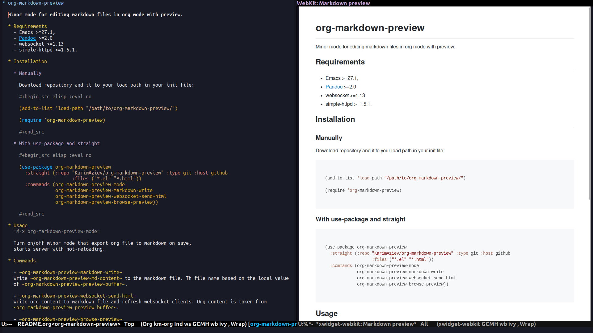

A real-time =markdown= and =org-mode= preview for Emacs.

This package converts Org buffers to Markdown with Pandoc and then renders the
resulting Markdown as HTML for live preview in your browser. It supports two
rendering workflows: local Pandoc conversion and an alternative GitHub API
conversion (via =ghub=) for GitHub-Flavored Markdown.

* Table of Contents                                       :TOC_3_gh:QUOTE:noexport:
#+BEGIN_QUOTE
- [[#requirements][Requirements]]
  - [[#programs][Programs]]
  - [[#emacs-packages][Emacs Packages]]
- [[#installation][Installation]]
  - [[#with-use-package][With use-package]]
    - [[#straightel][straight.el]]
    - [[#elpaca][elpaca]]
  - [[#manual-installation][Manual installation]]
- [[#usage][Usage]]
- [[#customization][Customization]]
- [[#screenshots][Screenshots]]
  - [[#org-mode-preview][Org-mode Preview]]
  - [[#markdown-mode-preview][Markdown-mode Preview]]
#+END_QUOTE

* Requirements

#+begin_quote
[!IMPORTANT]

Because communication with Emacs happens over WebSockets, your browser must
support both JavaScript and WebSocket connections. Supported browsers include
the Emacs Xwidget WebKit browser, Chrome, Firefox, and Safari. Lightweight
browsers without JavaScript support, such as Eww, will not work.
#+end_quote

** Programs
| Program | Version | Description                  |
|---------+---------+------------------------------|
| [[https://pandoc.org/installing.html][pandoc]]  | Latest  | Universal document converter |
| Emacs   | >=28.1  | Editor                       |

** Emacs Packages
| Package          | Version | Description                                     |
|------------------+---------+-------------------------------------------------|
| [[https://github.com/skeeto/emacs-http-server][simple-httpd]]     | >=1.5.1 | A simple Emacs web server                       |
| [[https://github.com/ahyatt/emacs-websocket][websocket]]        | >=1.15  | Websockets for Emacs                            |
| [[https://github.com/magit/ghub][ghub]]  (optional) | Latest  | GitHub API client (for alternative HTML render) |

* Installation

#+begin_quote
[!NOTE]

This package also needs the bundled HTML files used for preview rendering. If
you install it with a package manager that builds or copies files into a
separate directory, make sure your recipe includes them. Alternatively, point
to those files manually by setting =org-markdown-preview-html-source-file= and =org-markdown-preview-html-source-file-gh=.
#+end_quote

** With use-package

*** straight.el

With =straight.el=, you can install the package like this:

#+begin_src elisp :eval no
(use-package org-markdown-preview
  :straight (:repo "KarimAziev/org-markdown-preview"
             :type git
             :host github
             :files ("*.el" "*.html"))
  :commands (org-markdown-preview-mode
             org-markdown-preview-copy-org-as-markdown
             org-markdown-preview-copy-markdown-as-org
             org-markdown-preview-copy-html-as-org
             org-markdown-preview-copy-html-as-markdown))
#+end_src

*** elpaca

#+begin_src elisp :eval no
(use-package org-markdown-preview
  :ensure (:repo "https://github.com/KarimAziev/org-markdown-preview"
           :files ("*.el" "*.html"))
  :commands (org-markdown-preview-mode
             org-markdown-preview-copy-org-as-markdown
             org-markdown-preview-copy-markdown-as-org
             org-markdown-preview-copy-html-as-org
             org-markdown-preview-copy-html-as-markdown))
#+end_src

** Manual installation

Clone the repository wherever you like, for example into
=~/.emacs.d/org-markdown-preview/=:

#+begin_src shell :eval no
git clone https://github.com/KarimAziev/org-markdown-preview.git ~/.emacs.d/org-markdown-preview/
#+end_src

Then add that directory to your load path and require the package:

#+begin_src elisp :eval no
(add-to-list 'load-path "~/.emacs.d/org-markdown-preview/")
(require 'org-markdown-preview)
#+end_src

This setup works as-is because Emacs loads the package directly from the source directory, where the required HTML files are already present.

* Usage

To start the live preview, enable the minor mode in an Org or Markdown buffer:

~M-x org-markdown-preview-mode RET~

In =org-mode=, the mode converts the current buffer to Markdown and refreshes
the browser preview automatically. In Markdown buffers, it previews the current
buffer content directly.

The package also provides helper commands for copying converted content:
- ~org-markdown-preview-browse-preview~: Opens the preview page again if you
  closed the browser tab or window.
- ~org-markdown-preview-markdown-write~: Writes the current previewed Org
  buffer to a sibling Markdown file.
- ~org-markdown-preview-copy-markdown-as-org~: Copies the selected Markdown region as =org-mode= content.
- ~org-markdown-preview-copy-org-as-markdown~: Copies the selected =org-mode= region as Markdown content.
- ~org-markdown-preview-copy-html-as-org~: Copies the selected HTML region as =org-mode= content.
- ~org-markdown-preview-copy-html-as-markdown~: Copies the selected HTML region as Markdown content.

* Customization

Several settings let you fine-tune the conversion and preview experience. Some
of the most useful options are:

- ~org-markdown-preview-use-github-api~
  When non-nil (the default), HTML is rendered through GitHub's Markdown API.
  Otherwise, Pandoc is used locally.

- ~org-markdown-preview-websocket-port~
  The port on which the WebSocket server will run.

- ~org-markdown-preview-browse-fn~
  Function used to open the preview page. By default, it uses xwidgets when
  available and falls back to =browse-url= otherwise.

- ~org-markdown-preview-refresh-behavior~
  Determines when the preview is refreshed. The value should be the name of a
  hook, for example =after-save-hook= or =post-self-insert-hook=.

- ~org-markdown-preview-refresh-delay~
  Delay, in seconds, before the preview is refreshed after the refresh hook
  runs. If nil, updates happen immediately.

- ~org-markdown-preview-pandoc-options~
  Extra options to pass to Pandoc during the conversion.

- ~org-markdown-preview-scroll-delay~
  Delay, in seconds, after the last command before synchronizing the scroll
  position between Emacs and the preview.

- ~org-markdown-preview-pandoc-output-type~
  Specifies which Markdown flavor Pandoc should produce, for example =gfm=,
  =markdown=, or =markdown_mmd=.

* Screenshots

** Org-mode Preview
[[./demo-preview-org.png]]

** Markdown-mode Preview
[[./demo-preview-md.png]]
